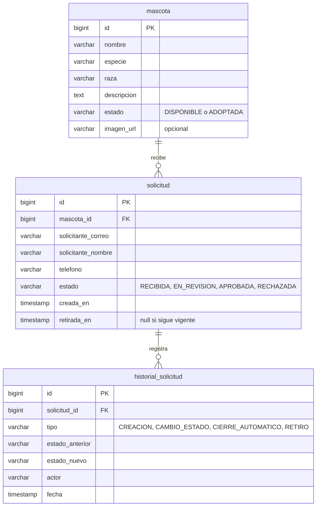

# Adopción responsable de mascotas

Backend (Java 25 + Spring Boot) para una fundacion que publica mascotas y gestiona solicitudes de adopcion con trazabilidad, sin exponer datos de contacto

## Modelo de datos

### Relaciones

- Una mascota recibe muchas solicitudes, cada solicitud pertenece a una sola mascota
- Cada solicitud registra muchos eventos en el historial: creación, cambios de estado, cierres automáticos y retiro

### Notas del modelo

- Retirar una solicitud no borra la fila: se marca `retirada_en`, para conservar la trazabilidad
- `historial_solicitud` solo recibe filas nuevas; nunca se modifica ni se reemplaza
- `solicitante_correo` y `telefono` son datos de contacto: no se devuelven en el catálogo ni en los listados
- La imagen de la mascota es una URL opcional que se guarda como texto
